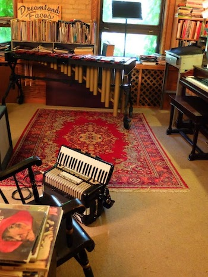
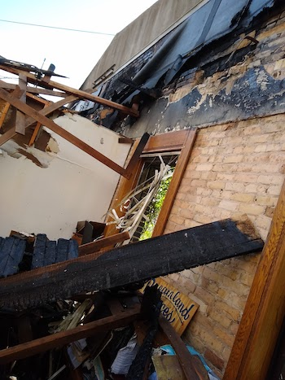
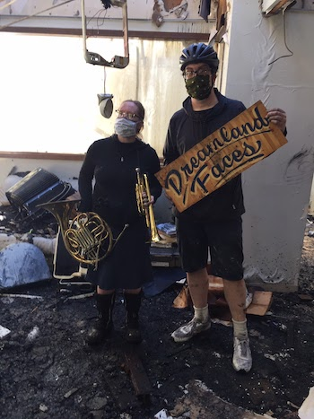

---
hide:
  - navigation
  - toc
  - footer
---

We had a studio at the Ivy Building in Minneapolis for 14 years, 2 blocks from the 3rd precinct. After George Floyd was murdered by police, a bar next door was set on fire. Flames drifted over and the studio roof caught the flames, caving in completely. Firefighters put it out, but everything inside was destroyed. We lost our instruments, music books, recording equipment, albums, and projects. No one was hurt, but the only surviving objects were a French horn, a cornet, and a sign painted by our friend, Phil Vandervaart. We have many fond memories of the room -  making music, preparing for shows, movies, and recordings. 

### Before the fire

<kbd>

</kbd>

### After the fire #1

<kbd>

</kbd>

### After the fire #2

<kbd>

</kbd>

