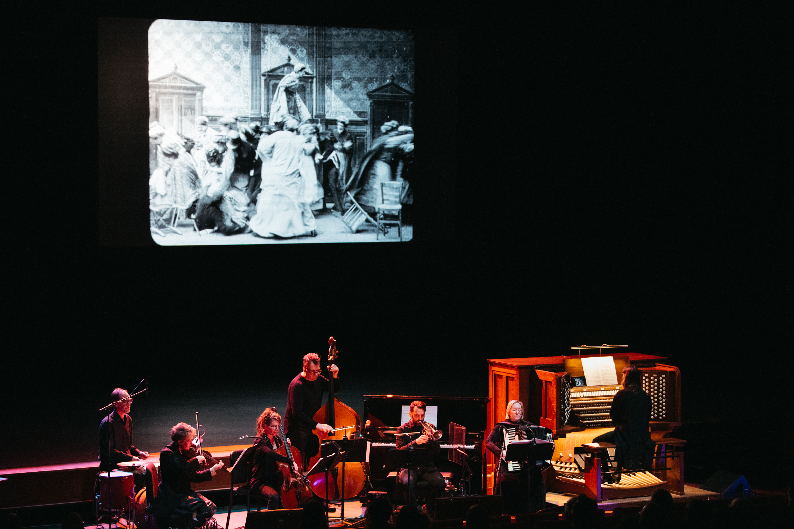

---
hide:
  - navigation
  - footer
---

# Silent films

*photo by Jayme Halbritter copyright 2023*

Dreamland Faces have composed and performed original scores to many silent films. Here are some of our favorites:

## Curated Live Film Programs

### Northrop Presents Cinema's First Nasty Women: CONTAGIOUS REVENGE

* The Dairymaid's Revenge (US, 1899, 2 min)
* La grève des nourrices (France, 1907, 12 min)
* Victoire a ses nerfs (France, 1907, 3 min)
* Zoé et la parapluie miraculeux (France, 1913, 4 min)
* Rembrandt de la rue Lepic (France, 1911, 6 min)
* La pile électrique de Léontine (France, 1910, 6.5 min)
* Laughing Gas (US, 1907, 7.5 min)
* Daisy Doodad's Dial (U.K., 1914, 9 min)
* La peur des ombres (France, 1911, 4 min)
* The Night Rider (US, 1920, 25 min)

### Northrop Presents Hysteria, Hypnosis, and Hallucination: Silent Cinema Shorts

read more here: [https://dreamlandfaces.github.io/hysteria/](https://dreamlandfaces.github.io/hysteria/)

* At the Hypnotist's (Chez le magnétiseur), Alice Guy-Blaché, Gaumont, France, 1897
* Hypnotizing the Hypnotist, Laurence Trimble, Vitagraph, US, 1911
* Rosalie Has Sleeping Sickness (Rosalie a la maladie du sommeil), Pathé, France, 1911
* Cunégonde the Coachwoman (Cunégonde femme cochère), Lux, France, 1913
* Love and Science (Amour et science), M.J. Roche, Éclair, France, 1912
* The Mystery of the Rocks of Kador (Le mystère des roches de Kador), Léonce Perret, France, 1912

### Twin Cities Silent Film Project
* PHIL FOR SHORT (Apfel, 1919)
* FIRST FLAME (1920) 
* PRINCESS NICOTINE; OR, THE SMOKE FAIRY (1909)

### Working Class films at Northern Spark 2015

* A Corner in Wheat (Griffith, 1909)
* Labor's Reward (AFL,1925)

### Dreamland Films: Treasures from the Eastman House

Experimental films & 28mm documentaries
Restored by the George Eastman House
Curated by Pat Doyen for Dreamland Faces.

* Haunted Hotel (Blackton) very early humorous horror
* Making a Record (c. 1919) documentary
* Mushroom Growing (c. 1915) documentary
* How the Cowboy Makes his Lariat (1917) documentary
* Bottom of the Sea (c. 1914) rare animation
* Very early X-ray films (Watson)
* In the Shadow of the Pyramids (c. 1915) travel documentary
* Houdini stunts, live footage (c. 1909-1923)
* Felix the Cat Flirts with Fate (Messmer, 1926)
* Felix Trifles with Time (Messmer, 1925)
* Dreamy Dud (1916) rare animation
* Kaleidoscope: very early color (c. 1925)
* Love, Snow and Ice: Ice carnival documentary (1915)
* Laureate (Etting, 1940) silent art film in early color

### Pioneers of Animation

Ten early animated films
Restored by the George Eastman House

* Scaling the Alps (Terry & Davis, 1923)
* Domestic Difficulties (Fisher, 1916)
* Weary Willies (Freleng and Lantz, 1929)
* Trapped (Fleischer, 1921)
* Breath of a Nation (La Cava, 1919)
* Felix the Cat Flirts with Fate (Messmer, 1926)
* Felix the Cat Trips through Toyland (Messmer, 1925)
* Priscilla and the Pesky Fly (Hopkins, 1916)
* The Old Family Toothbrush (Wilson, 1925)
* Bobby Bumps and his Goatmobile (Hurd, 1916)

## Feature Films (Dramas, Horror & Animation)

* BEGGARS OF LIFE (Wellman, 1928)
* BROKEN BLOSSOMS (Griffith, 1919)
* FALL OF THE HOUSE OF USHER (Watson, 1928)
* GRASS (Cooper & Schoedsack, 1925)
* HE WHO GETS SLAPPED (Sjöström, 1924)
* NOSFERATU: A SYMPHONE OF HORROR (Murnau, 1922)
* PHANTOM OF THE OPERA (Julien, 1925)
* SHOES (Weber, 1916)
* SUSPENSE (Weber, 1913)
* THE LION BECOMES OLD (Starewicz, 1932)
* THE PLEASURE GARDEN (Hitchcock, 1925)
* PRINCE ACHMED (Reiniger, 1926)
* SOUTH: ERNEST SHACKLETON AND THE ENDURANCE EXPEDITION (Hurley, 1919)
* THE UNKNOWN (Browning, 1927)
* THE WIND (Sjöström, 1928)
* TOKYO CHORUS (Ozu, 1931)
* VAMPYR (Dreyer, 1932)

## Comedies from the Slapstick/Vaudeville Canon

Buster Keaton:

* **Shorts**: One Week, Neighbors, The Scarecrow, The Haunted House, The Goat, The Boat, Cops, My Wife's Relations, The Electric House, The Balloonatic
* **Features**: Three Ages, Our Hospitality, Sherlock Jr., The Navigator, Seven Chances, The General, Steamboat Bill, Jr., The Cameraman, Spite Marriage

Roscoe Arbuckle: Coney Island, The Cook

Charlie Chaplin: The Rink, The Cure

Harold Lloyd: Speedy, Safety Last

Laurel & Hardy: Big Business

Teddy at the Throttle

## DVD Scores

[Cinema’s First Nasty Women - Kino Lorber DVD/Blu-Ray](https://wfpp.columbia.edu/cinemas-first-nasty-women/)

* Léontine en vacances
* Rosalie a la maladie du sommeil
* Les femmes cochers
* Girl Spy: An Incident of the Civil War
* A Range Romance
* Ventilateur Breveté (The Air Fan)
* Mary Jane's Mishap
* Her First Biscuits

## Frequently asked questions
!!! info
	
	[Read our FAQ about scoring for silent films.](scoringSilents.md)

