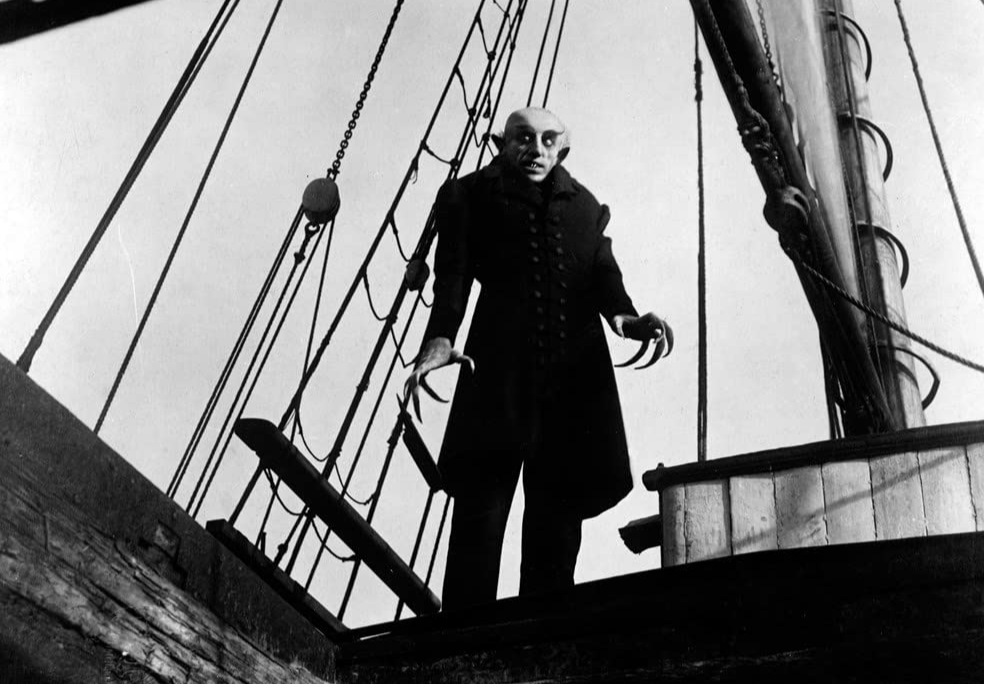

---
hide:
  - navigation
  - toc
  - footer
---

# Upcoming performances

-------------

- ## NOSFERATU (1922)
	{ width=50% align=right}

	Live silent film accompaniment

	**Sunday, October 15, 2023, 7:00 pm**

	[The Parkway Theater](https://theparkwaytheater.com/all-events/nosferatu-dreamland-faces)
	
	4814 Chicago Ave S, Minneapolis, MN
	
	Our ensemble for this film includes violin, viola, cello, bass, bassetti accordion, marimba, and musical saw. 

	

- ## ALL HANDS ON DECK: Dance, Metamorphosis, and Surreal Labor in Silent Cinema

	{ width=50% align=right}

	Live silent film accompaniment featuring Molly Raben on pipe organ

	**Tue, Nov 14, 2023, 7:00 pm CT**

	[Northrop at the University of Minnesota
](https://www.northrop.umn.edu/events/all-hands-on-deck-silent-cinema-2023)

	Ways to watch & listen: 

	* In-person
	* Livestream
	* On-demand through Nov 26, 2023

	### FILM LIST:
	
	**MADAME'S CRAVINGS**(Alice Guy-Blaché, France, 1906, 4:25 min)
	
	:	Short comedy directed by Alice Guy-Blaché before she moved from France to the US. A woman exhibits her multifarious maternity cravings in public.
	
	**WHEN A FILM CUTTER BLUNDERS** (O.F. Mauer, Germany, 1925, 14 min)
	
	:	An absurd depiction of the surrealist montage that ensues when a female film editor (or "cutter") has to meet a tight deadline after a raucous night out on the town.
	
	**HANDE** (Stella Simon, Germany, 1929, 15 min)
	
	:	A conventional love story is upended by depicting it in rhythmically choreographed encounters between disembodied hands. "The Life and Loves of the Gentler Sex" (from the original German title) has been reclaimed as a feminist film made by a female filmmaker that defamiliarizes gender clichés in uncanny abstraction.
	
	**DIE GROßE LIEBE EINER KLEINEN TäNZERIN** (Alfred Zeisler, Germany, 1924, 20 min)
	
	:	A grotesque puppet film about an alluring circus dancer who's cursed by a rival magician named Dr. Larifari to turn the head of any man who approaches her.
	
	**METAMORPHOSES** (Segundo de Chomon, France, 1912, 4:43 min)
	
	:	A female magician presents a series of fascinating tricks involving fire, puppets, and stop motion animation.
	
	**FIELDWORK FOOTAGE** (Zora Neale Hurston, US, 1928, 6:45 min)
	
	:	Ethnographic footage filmed by Zora Neale Hurston for her thesis research depicting rural, Black communities in the Southern US in the 1920s.
	
	**THE DRAGONFLY AND THE ANT** (Vladislaw Starewicz, Russia, 1913, 4:45 min)
	:	Pre-Soviet stop motion animation starring dead bugs: a tale of labor and zoomorphic revenge.

